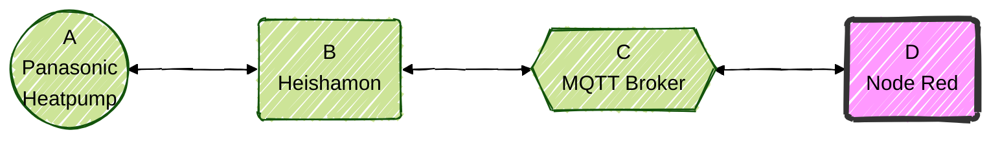

  

  

********

**Current version:** v26.2.1 Stable 
**Release date:** 2026-02-10

********

## Table of Content
- [Introduction](#introduction)
- [Requirements](requirements.md)
- [Installation](installation.md)
- [Starting for the First time](#first_start)
  - [Starting procedure](#starting_procedure)
  - [Guidelines and tips](#guidelines_and_tips)
    - [How to personalize or customize](#howto_personalize_customize)  
- [Updating instructions](#updating)
- [FAQ](faq.md)
- [Acknowledgments](acknowledgments.md)
- [Donations](donations.md)  

********

<!-- headings -------------------------------->

## Abstract
This repository holds a **Node Red flow** which gives you a user friendly dashboard for local control of your Panasonic heatpump via heishamon.  

## Introduction
You can connect your Panasonic heatpump to the default CZ-TAW1 module. Then you are locked in the Panasonic ecosystem depending on using the wallmounted controller or Aquarea Smart Cloud.

Alternatively you can connect and control your Panasonic heatpump locally with Heishamon. The heishamon board is created by Egyras. AWESOME job!  
You can get one from here: https://www.tindie.com/stores/thehognl/  

*  A > B: The Panasonic heatpump communicates with the heishamon board
*  B > C: Heishamon communicates with your MQTT broker
*  C > D: Node Red communicates with the MQTT brokker

I have chosen to use **Node Red** (=NR) as FrontEnd and automation platform. 
In this repository you will find out all about this Node Red flow.

### What can this Node Red flow do for you (simple benefits)
So, what can it do.
* Offers **local control**. No dependancy on Panasonic Claud at all.
* It provides a nice **dashboard**.
* Shows detailed **graphs and charts** with real‑time or historical data.
* Allows advanced **custom functions** such as CCC, RTC, SoftStart, and Solar‑driven DHW optimizations.
* Works with **any sensor** for the custom functions. 
* **Automations** using schedules with conditions.

### Dashboard impression
Here are just a few images to show the dashboard. For more images look >> here <<

*Home dashboard* 

 

*RoomTemperatureCorrection function* 

  

[Back to top](#index)

********

<!-- headings -------------------------------->

<!-- headings -------------------------------->

********

<!-- headings -------------------------------->

## How to create a backup of your current flow

There is no easy solution currently know by me to update only changed nodes or flows.  
First: Create a backup of current version. Select all tabs by holding CTRL. Then in the right menu select Export > Download.   

  RightMouseClick on the GIF and select open in a new tab to see it full screen. 
[Back to top](#index)

<!-- headings -------------------------------->

## How to update to a newer version

	
Update to newer version: 	
I found it is easiest to:  
1, remove the tabs, WP MQTT, WP Dash, WP Control, WP Solar, WP Scheduler completely  
2, remove all ui_base, ui_group and ui_tab references from the flows.  
	*Keep the MQTT (x.x.x.x) and Home Assistant references. 
3, import new version  
4, correct setup, eg. MQTT server.  
5, re-connect your personalization’s.  
	*Not nessesary if you used a WP_Personal tab (see FAQ.md). 
If there are better ideas about this, please inform me.    

  RightMouseClick on the GIF and select open in a new tab to see it full screen. 
[Back to top](#index)	

********

<!-- headings -------------------------------->

[Back to top](#index)

(<a href="#top">back to top</a>)

