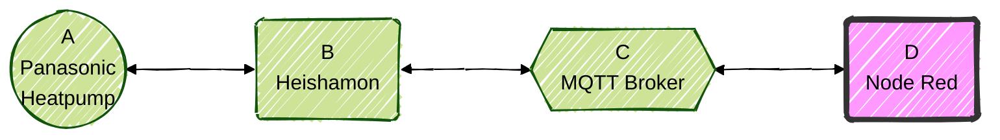

<span style="display:inline-block; margin-right:6px;">
  <a href="https://www.paypal.com/donate?business=ed_terbak%40hotmail.com&no_recurring=0&item_name=Support+my+work&currency_code=EUR">
    
  </a>
</span>
<span style="display:inline-block;">
  <a href="https://ko-fi.com/edterbak">
    
  </a>
</span>

********

**Current version:** v26.2.1 Stable<br>
**Release date:** 2026-02-10


********

<a id="index"></a>
## Table of Content
- [Introduction](#introduction)
- [Requirements](requirements.md)
- [Installation](installation.md)
- [Starting for the First time](#first_start)
  - [Starting procedure](#starting_procedure)
  - [Guidelines and tips](#guidelines_and_tips)
    - [How to personalize or customize](#howto_personalize_customize)  
- [Updating instructions](#updating)
- [FAQ](#faq)
- [Acknowledgments](#acknowledgments)
- [Donations](#donations)  

********

<!-- headings -------------------------------->

## Abstract
This repository holds a node red flow which gives you a user friendly dashboard for local control of your Panasonic heatpump via heishamon. <br>

<a id="introduction"></a>
## Introduction
You can connect your Panasonic heatpump to the default CZ-TAW1 module. Then you are locked in the Panasonic ecosystem depending on using the wallmounted controller or Aquarea Smart Cloud.

Alternatively you can connect your Panasonic heatpump to Heishamon. The heishamon board is created by Egyras. AWESOME job! <br/>
You can get one from here: https://www.tindie.com/stores/thehognl/ <br/>

* []() A > B: The Panasonic heatpump communicates with the heishamon board
* []() B > C: Heishamon communicates with your MQTT broker
* []() C > D: Node Red communicates with the MQTT brokker

I have chosen to use **Node Red** (=NR) as FrontEnd and automation platform. 
In this repository you will find out all about this Node Red flow.

### What can this Node Red flow do for you (simple benefits)
So, what can it do.
* Offers **local control**. No dependancy on Panasonic Claud at all.
* It provides a nice **dashboard**.
* Shows detailed **graphs and charts** with real‑time or historical data.
* Allows advanced **custom functions** such as CCC, RTC, SoftStart, and Solar‑driven DHW optimizations.
* Works with **any sensor** for the custom functions. 
* **Automations** using schedules with conditions.

### Dashboard impression
Here are just a few images to show the dashboard. For more images look >> here <<

*Home dashboard*<br>

<br>

*RoomTemperatureCorrection function*<br>

<br><br>


[Back to top](#index)

********
<a id="installation"></a>


<!-- headings -------------------------------->
<a id="requirements"></a>
## Requirements on the Node Red install:<br/>
<details>

A - Persistent data folder.

B - Adjust settings.js.

C - TimeZone setup

D - Required Node Red libraries/pallets

But first; Why?  
I found that after reboot of node red, the logic did not have all variables populated yet. This caused the system not to start automatically where it left off before reboot.  
To be honest, this does not present a major problem to me, but it will reduce the overall WAF significantly when I don’t notice something like this in time. So, I had to look for a solution to make the programmed setpoints, and all other variables, stick. This is how I achieved that. (Maybe there are better options, feel free to help me on this 😊 )  
Please also note that this flow writes to disk every 5 minutes. Storage on sd-card is not advised because of possible high wear levels.

### A - Data folder
Make sure Node Red is installed with persistent local volume available. <br/>
If you have Node Red running directly inside Linux (not using docker) or on a RPI, this is already okay and you don't need to create a data folder.
If you have Node Red running in a docker container, make sure you install with this parameter:
```
-v FOLDER:/data
```
Here you can choose the name "FOLDER" yourself which will be the local storage folder of NR.<br/>

If you are node red withing Home Assistant, which is a HA controlled container, follow these instructions:
https://github.com/edterbak/NodeRed_Heishamon_control/tree/main/HomeAssistant
<br/>	
### B - Adjust settings.js
You need to change some settings in settings.js<br/>
Why? If you reboot node red, you will notice some of the variables are not populated yet. Setpoints we have programmed earlier are gone. To make them persistent after reboots, you have to enable the local storage option. Below I have set the flush interval (write to disk) to 300s. 

In a (proxmox) docker install, you can find this settings.js file in:
```
/var/lib/docker/volumes/FOLDER/_data
```
where 'FOLDER' is your own folder name chosen in part A. 

On a Raspberry Pi, you can find this settings.js file here:
```
/home/pi/.node-red/settings.js".
```

Search for contextStorage:
Put in the text as below:
```
contextStorage: {
	default: "memoryOnly",
	memoryOnly: { module: 'memory' },
	file: { module: 'localfilesystem', config: {flushInterval: '300'}, }
},
```
Reboot Node Red for the changes to load.<br/>

ATTENTION: <br/>
After you have done this, and you seem to have it operational, be sure to test if all settings *stick* after a reboot of Node Red. Things that should stick are: Virtual SP (Ta), Function toggles on the main page, Setpoints in WAR function/graph. Setpoints for RTC function/graph, Heat Pump power toggle on/off
If this is not the case for you, you either need to correct this in settings (like given above), or choose not to use this NR flow, or even accept manual action needed after power loss situations.

### C - Timezone setup
If you use a linux version, make sure you set your correct timezone. You can do this by running this command from CLI root and go through the setup process.
```
dpkg-reconfigure tzdata
```
You can check if it was successful by executing this command
```
timedatectl 
```
If you are running Node Red from within HomeAssistant, follow the instructions from HomeAssistant on how to do that.

### D - Required Node Red libraries/pallets
To make use of the dashboard functionality, you need to install the dashboard library.<br/>
https://flows.nodered.org/node/node-red-dashboard <br/>
The scheduler makes use of the moment lib.<br/>
https://flows.nodered.org/node/node-red-contrib-moment <br/>
node-red-contrib-noop is used as well <br/>
https://flows.nodered.org/node/node-red-contrib-noop <br/>
node-red-contrib-dashboard-bar-chart-data (from v13+)<br/>
https://flows.nodered.org/node/node-red-contrib-dashboard-bar-chart-data <br/>
node-red-node-smooth (from 20+)<br/>
https://flows.nodered.org/node/node-red-node-smooth<br/>

[Back to top](#index)
</details>

<!-- headings -------------------------------->
<a id="howtoinstallnr"></a>

## Flow installation:<br/>
<details>
Dashboard: http://IP:1880/ui	(For HomeAssistant: http://IP:1880/endpoint/ui)
Flows: http://IP:1880/#flow

* []() In NR, click on the hamburger icon (three horizontal stripes) in the top right corner
* []() Select Import
* []() Copy/past the content of the .JSON file from this GIT. (or select a file to upload and select the flow.json file offered here)
* []() Click on Import

Once imported, you need to adjust the settings of the MQTT server. <br/>
1. Add the correct information of your broker
2. Use QOS: 0 or 1 (maximum for heishamon).
3. Use MQTT v3.1.1 (maximum for heishamon).
Click on the hamburger icon and then configuration nodes. Find the MQTT broker part, double click it and change to your settings.<br/>
<br/>

Important >> After import and correcting the MQTT settings, and you might want to connect custom external sensors.<br/>
By default the native Panasonic sensors will be used. But you can connect your custom sensor.  For this go to the flow page to the tab [WP Input], the section indicated below in purple section.
  
You can also connect external signals to the flow in this tab. 

** Note 1: The Panasonic Room Thermostat is not very accurate which might cause bad temperature control. <br/>
** Note 2: The Outside temperature sensor on the Panasonic might be subject to heating up due to direct sunlight. This can also have a negative impact on the functions. Personally I use OpenWeatherMap source for outside temperature, but anything is possible.<br/>

[Back to top](#index)

### Opening the dashboard
You can find the link to the dashboard like this:<br/>
 

[Back to top](#index)
</details>

<!-- headings -------------------------------->
<a id="howto_personalize_customize"></a>
## How to personalize or customize
<details>
It is advised to create a separate tab for your external sources. Any source available in Node Red can be conditioned and used as a sensor in the functions. If you do this in an 'personal tab', then it is likely easier to update later to newer versions. (no guarantees of course)<br/>

[Back to top](#index)
</details>

********


<!-- headings -------------------------------->
<a id="howto_backup"></a>
## How to create a backup of your current flow
<details>
There is no easy solution currently know by me to update only changed nodes or flows. <br/>
First: Create a backup of current version. Select all tabs by holding CTRL. Then in the right menu select Export > Download. <br/><br/>

 <br/>RightMouseClick on the GIF and select open in a new tab to see it full screen.<br/>
[Back to top](#index)
</details>

<!-- headings -------------------------------->
<a id="howto_update"></a>

## How to update to a newer version
<details>	
Update to newer version:<br/>	
I found it is easiest to:<br/> 
1, remove the tabs, WP MQTT, WP Dash, WP Control, WP Solar, WP Scheduler completely<br/> 
2, remove all ui_base, ui_group and ui_tab references from the flows.<br/> 
	*Keep the MQTT (x.x.x.x) and Home Assistant references.<br/>
3, import new version<br/> 
4, correct setup, eg. MQTT server.<br/> 
5, re-connect your personalization’s.<br/> 
	*Not nessesary if you used a WP_Personal tab (see FAQ.md).<br/>
If there are better ideas about this, please inform me. <br/> <br/>

 <br/>RightMouseClick on the GIF and select open in a new tab to see it full screen.<br/>
[Back to top](#index)	
</details>

********

<!-- headings -------------------------------->
<a id="dashboard"></a>

## The Dashboard

<!-- headings -------------------------------->
<a id="home"></a>
### Home
This is the home page of the dashboard.  


Visible is a short overview of the current status of the heat pump.  
You can enable / disable, see the status and the result of each custom function.  

In the column "HEAT" there are a number of custom functions. These functions build on top of each other and you should read them from top to bottom.  
1. Starting point is "Shift curve" or "Water temp." value. The [setpoint] for Compensation curve or Direct mode.
2. When the WAR function is enabled, it replaces the [setpoint] from 1.
3. When the RTC function is enabled, it corrects the [setpoint] from 2.
4. When the SoftStart function is enabled, it corrects the [setpoint] from 3.
5. When the Nightreduction function is enabled, it corrects the [setpoint] from 4. (Note: night reduction will be deprecated soon!)
<br/>

More details and screenshots of each of the dashboard tabs are present in the collapsed section below.  
[Back to top](#index)

<!-- headings -------------------------------->
<a id="settings"></a>
### Settings
  
Here are some basic controls of the heat pump. (Not all, because the flow is designed for 1 zone config. )


<!-- headings -------------------------------->
<a id="charts"></a>
## Charts

<!-- headings -------------------------------->
<a id="temperature"></a>
### Temperature


[Back to top](#index)
<!-- headings -------------------------------->
<a id="energy"></a>
### Energy


[Back to top](#index)
<!-- headings -------------------------------->
<a id="degreedays"></a>
### Degree Days
  

[Back to top](#index)
<!-- headings -------------------------------->
<a id="system"></a>
### System
  

In this tab you have multiple sub-sections.  
1. LOG: See 1000 lines back of all logged events.
2. HARDWARE: Basic readings of the hardware configuration.
3. SENSOR: Select the external or 1wire sensors for custom functions. 
4. MQTT: Enable / disable general MQTT block. Basic reading of MQTT messages.
5. MENU CONFIG: Enable / disable parts of the dashboard menu.
6. SYSTEM HEALTH: Extended logging and system information.

[Back to top](#index)

********
<a id="faq"></a>
## FAQ


Q - Can I forward the information coming mqtt messages from the heat pump towards my InfluxDB database? 
<details>
    Yes. There is a separate flow available to download. You can find it in the folder "heishamon2influxdb". It requires an additional contrib (node-red-contrib-influxdb). Install the contrib, download the flow, import it, configure the influxdb and your set. You do not need Domoticz or Home Assistant fot that now.
</details>

Q - I use the Node Red Addon in Home Assistant, how to go to the Node Red Gui for editing?
<details>
    Most users should visit via a browser: 'http://Your_NodeRed_IP:1880/ui'<br/>
    In my case this wasn't working, perhaps due to the use of the DuckDNS addon. <br/>
    Use something like 'https://your.duckdns.org:1880/endpoint/ui/' instead.<br/>
</details>
    
Q - Can I use both WAR and RTC at the same time?
<details>
    Yes. If you have both enabled, the WAR function first calculates the SP (Setpoint) depending on outside temperature. Next the RTC function will correct that SP(war) depending on the room temperature. The only SP going to the heat pump will be SP at the end of all the calculations/corrections.
</details>

Q - If I switch off the heatpomp via the Remote Controller will it disable the automation from the Node Red flow also?
<details>
    No, both will work separately. If you turn the heat pump on via the Remote Controller, the pump will switch on.<br/>
    Keep in mind however that if the Node Red flow decides it time to adjust some settings it will act accordingly and overwrite settings.<br/>
</details>

Q - I know the function SOFTSTART is experimental, but can you explain what this function does?
<details>
    The idea behind this function is that when the compressor is just started, the frequency of the compressor goes up to 45+Hz. Well out of the efficient range. This is caused by the inner controller of the heat pump. When turned on, it 'wants' to see the impact of the compressor. It looks at the returning water temperature for this. Only when the water temperature returning towards the heat pump is nearing the target temperature, it will start to lower the compressor frequency and get in a stable/efficient mode. Throttling... <br/>
This late throttling behavior can be quiet energy consuming, it can cause the heat pump to generate too much heat at the start and turn off again. <br/><br/>
This SOFTSTART function, when enabled, looks at the moment when the compressor is on, and lower the setpoint to just above the temperature of the returning water. This will in theory cause the heat pump to start throttling down a lot quicker. 
<br/>This function can be useful directly after defrost cycles when the pump starts again, or when the temperature difference between outside/inside is getting smaller. 
</details>

Q - How do I add my Entities from Home Assistant like living room temperature?
<details>
    In the Node Red Gui (http://Your_NodeRed_IP:1880/ui) you will have to go to the [WP Input] tab;<br/>
    In the square "REQUIRED INPUTS FOR FUNCTIONS" you will have to add a node (left pane under Home Assistant) named "Events: state".<br/>
    You can drag and drop this in the square mentioned first.<br/>
    It will replace the "TOP33 - panasonic_heat_pump/main/Room_Thermostat_Temp"-node eventually, which you should disable if not using.<br/>
    Select the newly created node, then double click to open up the properties window;<br/>
    Give is a name of your choosing like 'LivingRoom_temperature'<br/>
    In the Entity box you can try to find your sensor entity (assuming you have already setup the MQTT settings earlier).<br/>
    Make sure that in the 'Output properties' you have a MSG.PAYLOAD = EVENT STATE<br/>
    Check the box 'output on connect' and make sure at the bottom this node is enabled.<br/>
    Finally press DONE to close the properties dialog and connect your node to the function node 'set.T_woonkamer_BT'<br/>
     <br/>
 </details>
 
Q - How to use a dark theme in the dashboard?
 <details>
    In the Node Red Gui (http://Your_NodeRed_IP:1880/ui) press the top most right arrow-down sign and select dashboard;<br/>
    Now press the Theme-tab and pick your style.<br/>
     <br/>
</details>

Q - How to update flow to latest version and keep my inputs, MQTT and Home Assistant settings?
 <details>
    Create a personal tab (WP Personal) and place your inputs here (P1, Temperature sensors)<br/>
    Give those inputs.sensors each an own [Link Out] node<br/>
    Connect those [Link Out] nodes to the already existing [Link In] nodes by double clicking the [Link Out] node and select the corresponding one from the list.<br/>
     Some images to explain this:<br/>
     <br/>
     <br/>
     <br/>
    Follow the update procedure from the Readme as described here: https://github.com/edterbak/NodeRed_Heishamon_control#how-to-update-to-a-newer-version
</details>

[Back to top](#index)

********
<a id="changelog"></a>
## Release changelog


Version 25.02</br>
</br>
Changes:</br>
- Fix "Boost DHW now" funciton. Switching to COOL mode when DHW mode is already active.<br>
- Added Energy production for HEAT and DHW bar-chart. Thanks to WP-Rue !!!<br>
- Added BufferTankDelta to the settings page<br>
- Added BufferTank info in SYSTEM > Hardware page<br>
- Improved WP Input tab a lot on connections from external sources. Much clearer<br>

Version 25.01</br>
</br>
Changes:</br>
- Added "Use Force DHW" toggle on Solar²DHW tab. This can be enabled to solve DHW runs which never end.<br>
- Attempt to fix possible blanc MQTT commands to OperatingMode after BOOST DHW now function.<br>
- Attempt to fix Boost DHW now toggle 'sticking'

<ins>Major changes v25.00:</ins></br>
- Firmware Support: Added compatibility with Heishamon Firmware 3.9</br>
- SoftStart function rewrite: now with improved relax frequency and TCAP recognition</br>
- Scheduler Enhancements: Added more actions</br>
- Scheduler Enhancements: Added more advanced conditions (room/outside temperature thresholds)</br>
- Sensors: Added extra 1-wire sensor support to show in graphs of DHW, HEAT, and ROOM temps</br>
</br>

SoftStart function:</br>
- SoftStart Fixes: Resolved bugs related to defrost phase and startup loops</br>
</br>

<ins>RTC function:</ins></br>
- Multiple improvements to prevent premature triggering</br>
- Multiple improvements for the reverting actions</br>
- MQTT Fixes: Eliminated repeating commands like SetZ1CoolRequestTemperature</br>
</br>

<ins>Charts & UI Improvements:</ins></br>
- Home screen: If Fan2 is present, it will show up (and stay) after first value enters.</br>
- Home screen: Added Heater, it will show up (and stay) after first value enters. And when active, it will light up.</br>
- Translated some chart labels from Dutch to English</br>
</br>

<ins>Solar²DHW:</ins></br>
- Forced DHW-only mode during a run for better compatibility with HEAT+DHW</br>
- Improved kWh calculations and graph visuals</br>
- More robust energy tracking in Solar²DHW (fixed NaNs, graph is now more robust, but could increase loading a bit)</br>
- Moved P1 setup to [SYSTEM] > [SENSORS] tab. Much better.</br>
</br>

Miscellaneous Fixes:</br>
- Reading Panasonic details logic rewritten for fw3.9</br>
- Powerful mode toggle fix</br>
- Pressure readout (TOP115) added</br>


[2025-04-24] v25.00 Stable.
changes compared to 25.00 will be listed here over time.

[Back to top](#index)
********
<!-- headings -------------------------------->
<a id="acknowledgments"></a>
## Acknowledgments


* []() Egyras: The original creator of Heishamon. https://github.com/Egyras
* []() Egyras: For the MQTT topic list - https://github.com/Egyras/HeishaMon/blob/master/MQTT-Topics.md
* []() CurlyMo: The original calculation for automagical 'Stooklijn' correction - https://gathering.tweakers.net/forum/list_messages/2039982#Automagische_stooklijncorrectie
* []() AUijtdehaag: The COP calculation - https://github.com/Dylantje/WP-Heishamon-sripts/blob/master/WP%20LUA%20COP%20berekening
* []() lampy25. For unselfishly giving supportive feedback and good idea's. Thanks!
* []() timovd for his contributions. ! Thanks.
* []() E1cid from Node Red forum, for the help with the bar-chart. 
* []() Javaboon for his assistance in the Solar functionality.
* []() Maarten69 for his feature requests and helping with testing. MEGAAA THANKS :).
* []() Maarten69 (yes, again) for contributing to this project and helping with a FAQ !!!!! :).
* []() Aikon for contributing to this project and helping with layout/textual improvements.
* []() Maarten69 for contributing to this project. New additions can be expected from him on this project. Mega sweet!!
* []() MikeyMan for contributing with testing and discussing a lot about this. Good testing is very valuable!
* []() Blb4, Aziona, ConQuestador and BazemanKM for their continued time and involvement.
* []() Hemertje voor zijn tomeloze energie en toevoegingen! 😃


[Back to top](#index)

<!-- headings -------------------------------->
<a id="donations"></a>
## Donations
By multiple users of the Node Red flow, I have been asked to put up a donation on the site. I was never that fond of that idea, because it is just my hobby and I like doing it. In addition, I do not want to change the expectation of users, the open character of the communication here (moving from one enthusiast>enthusiast to a supplier>client relationship).  
This remains just a hobby, and I do not expect I can quit my daytime job because of this anytime soon.. Ghhehehe.. And of course it will stay like this.<br>
But the constant raising eyebrows of my social circle why I don't have such a button (because everyone else seems to do it..), and the curiosity about how many users actually want to make a donation have won me over to try such a button. Let's see. <br>
<br>
But most important. In no way you are obliged to make any donation!! The flow remains completely free, free to use, free to change as you want. And as always at your own risk. <br>

<span style="display:inline-block; margin-right:0px;">
  <a href="https://www.paypal.com/donate?business=ed_terbak%40hotmail.com&no_recurring=0&item_name=Support+my+work&currency_code=EUR">
    
  </a>
</span>
<span style="display:inline-block;">
  <a href="https://ko-fi.com/edterbak">
    
  </a>
</span>

[Back to top](#index)
********

**My request to you:**<br/>
When you choose to use/try this (Feel free to do so), PLEASE give feedback on any issues you encounter. You can use the [Issues] section to report to me. <br/>
When making an issue, please give as much info as you think is required to solve this. Steps to reproduce. Maybe a screenshot etc. Reporting this will help me help you :) <br/>Thank you in advance. 

[Back to top](#index)
<p align="right">(<a href="#top">back to top</a>)</p>
